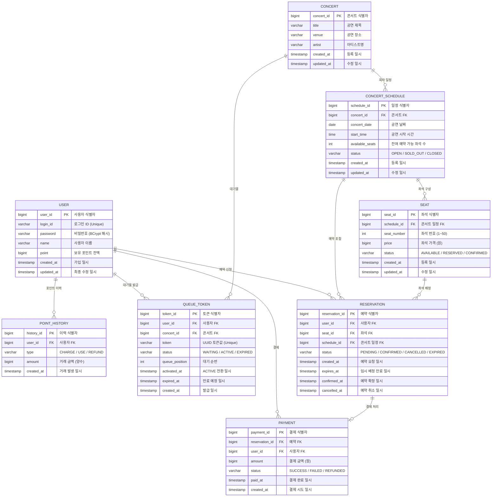

# 콘서트 예약 시스템 ERD 테이블 명세서

---

## ERD (Mermaid)

---

## 1. 테이블 목록

| # | 테이블명 | 설명 |
|---|---------|------|
| 1 | `USER` | 사용자 기본 정보 및 보유 포인트 |
| 2 | `POINT_HISTORY` | 포인트 충전·사용·환불 이력 |
| 3 | `QUEUE_TOKEN` | 대기열 토큰 발급 및 상태 관리 |
| 4 | `CONCERT` | 콘서트 기본 정보 |
| 5 | `CONCERT_SCHEDULE` | 콘서트 날짜별 회차 일정 |
| 6 | `SEAT` | 회차별 좌석 정보 |
| 7 | `RESERVATION` | 좌석 예약 요청 및 상태 |
| 8 | `PAYMENT` | 결제 처리 및 이력 |

---

## 2. 테이블 명세

### 👤 USER (사용자)

> 서비스를 이용하는 사용자 기본 정보 및 보유 포인트를 관리합니다.

| 컬럼명 | 타입 | NULL | KEY | 설명 |
|--------|------|------|-----|------|
| `user_id` | BIGINT | NOT NULL | PK | 사용자 식별자 (Auto Increment) |
| `login_id` | VARCHAR(100) | NOT NULL | | 로그인 ID (Unique) |
| `password` | VARCHAR(255) | NOT NULL | | 비밀번호 (BCrypt 해시값) |
| `name` | VARCHAR(50) | NOT NULL | | 사용자 이름 |
| `point` | BIGINT | NOT NULL | | 보유 포인트 잔액 (기본값 0, 음수 불가) |
| `created_at` | TIMESTAMP | NOT NULL | | 가입 일시 |
| `updated_at` | TIMESTAMP | NOT NULL | | 최종 수정 일시 |

---

### 💳 POINT_HISTORY (포인트 이력)

> 포인트 충전·사용·환불 이력을 관리합니다. `USER.point`와 합산이 일치해야 합니다.

| 컬럼명 | 타입 | NULL | KEY | 설명 |
|--------|------|------|-----|------|
| `history_id` | BIGINT | NOT NULL | PK | 이력 식별자 (Auto Increment) |
| `user_id` | BIGINT | NOT NULL | FK | 사용자 식별자 → USER.user_id |
| `type` | VARCHAR(10) | NOT NULL | | 거래 유형 : CHARGE(충전) / USE(사용) / REFUND(환불) |
| `amount` | BIGINT | NOT NULL | | 거래 금액 (항상 양수, 원 단위) |
| `created_at` | TIMESTAMP | NOT NULL | | 거래 발생 일시 |

---

### 🎫 QUEUE_TOKEN (대기열 토큰)

> 유저 대기열 진입 시 발급되는 토큰을 관리합니다. 콘서트별로 활성 토큰 수를 제한하여 트래픽을 제어합니다.

| 컬럼명 | 타입 | NULL | KEY | 설명 |
|--------|------|------|-----|------|
| `token_id` | BIGINT | NOT NULL | PK | 토큰 식별자 (Auto Increment) |
| `user_id` | BIGINT | NOT NULL | FK | 사용자 식별자 → USER.user_id |
| `concert_id` | BIGINT | NOT NULL | FK | 콘서트 식별자 → CONCERT.concert_id |
| `token` | VARCHAR(36) | NOT NULL | | UUID 토큰 값 (Unique) |
| `status` | VARCHAR(10) | NOT NULL | | 토큰 상태 : WAITING / ACTIVE / EXPIRED |
| `queue_position` | INT | NULL | | 대기 순번 (WAITING 상태일 때만 유효) |
| `activated_at` | TIMESTAMP | NULL | | ACTIVE 전환 일시 |
| `expired_at` | TIMESTAMP | NOT NULL | | 만료 예정 일시 |
| `created_at` | TIMESTAMP | NOT NULL | | 토큰 발급 일시 |

---

### 🎵 CONCERT (콘서트)

> 콘서트 기본 정보를 관리합니다. 하나의 콘서트는 여러 일정(CONCERT_SCHEDULE)을 가질 수 있습니다.

| 컬럼명 | 타입 | NULL | KEY | 설명 |
|--------|------|------|-----|------|
| `concert_id` | BIGINT | NOT NULL | PK | 콘서트 식별자 (Auto Increment) |
| `title` | VARCHAR(200) | NOT NULL | | 공연 제목 |
| `venue` | VARCHAR(200) | NOT NULL | | 공연 장소 |
| `artist` | VARCHAR(100) | NOT NULL | | 아티스트명 |
| `created_at` | TIMESTAMP | NOT NULL | | 등록 일시 |
| `updated_at` | TIMESTAMP | NOT NULL | | 수정 일시 |

---

### 📅 CONCERT_SCHEDULE (콘서트 일정)

> 콘서트의 날짜별 회차 정보를 관리합니다. `available_seats`는 동시성 제어 대상입니다.

| 컬럼명 | 타입 | NULL | KEY | 설명 |
|--------|------|------|-----|------|
| `schedule_id` | BIGINT | NOT NULL | PK | 일정 식별자 (Auto Increment) |
| `concert_id` | BIGINT | NOT NULL | FK | 콘서트 식별자 → CONCERT.concert_id |
| `concert_date` | DATE | NOT NULL | | 공연 날짜 |
| `start_time` | TIME | NOT NULL | | 공연 시작 시간 |
| `available_seats` | INT | NOT NULL | | 잔여 예약 가능 좌석 수 (낙관적 락 권장) |
| `status` | VARCHAR(15) | NOT NULL | | 일정 상태 : OPEN / SOLD_OUT / CLOSED |
| `created_at` | TIMESTAMP | NOT NULL | | 등록 일시 |
| `updated_at` | TIMESTAMP | NOT NULL | | 수정 일시 |

---

### 🪑 SEAT (좌석)

> 콘서트 일정별 좌석 정보를 관리합니다. 좌석번호는 1~50 범위이며, `RESERVED` 상태인 경우 만료 처리 대상입니다.

| 컬럼명 | 타입 | NULL | KEY | 설명 |
|--------|------|------|-----|------|
| `seat_id` | BIGINT | NOT NULL | PK | 좌석 식별자 (Auto Increment) |
| `schedule_id` | BIGINT | NOT NULL | FK | 콘서트 일정 식별자 → CONCERT_SCHEDULE.schedule_id |
| `seat_number` | INT | NOT NULL | | 좌석 번호 (1~50, schedule_id와 Unique 조합) |
| `price` | BIGINT | NOT NULL | | 좌석 가격 (원 단위, 0 이상) |
| `status` | VARCHAR(15) | NOT NULL | | 좌석 상태 : AVAILABLE / RESERVED / CONFIRMED |
| `created_at` | TIMESTAMP | NOT NULL | | 등록 일시 |

---

### 📋 RESERVATION (예약)

> 사용자의 좌석 예약 요청 및 상태를 관리합니다. `expires_at` 기준으로 미결제 예약을 자동 만료 처리합니다.

| 컬럼명 | 타입 | NULL | KEY | 설명 |
|--------|------|------|-----|------|
| `reservation_id` | BIGINT | NOT NULL | PK | 예약 식별자 (Auto Increment) |
| `user_id` | BIGINT | NOT NULL | FK | 사용자 식별자 → USER.user_id |
| `seat_id` | BIGINT | NOT NULL | FK | 좌석 식별자 → SEAT.seat_id |
| `schedule_id` | BIGINT | NOT NULL | FK | 콘서트 일정 식별자 → CONCERT_SCHEDULE.schedule_id |
| `status` | VARCHAR(15) | NOT NULL | | 예약 상태 : PENDING / CONFIRMED / CANCELLED / EXPIRED |
| `created_at` | TIMESTAMP | NOT NULL | | 예약 요청 일시 |
| `expires_at` | TIMESTAMP | NOT NULL | | 임시 배정 만료 일시 (created_at + 5분) |
| `confirmed_at` | TIMESTAMP | NULL | | 예약 확정 일시 (결제 완료 시 설정) |
| `cancelled_at` | TIMESTAMP | NULL | | 예약 취소 일시 |

---

### 💰 PAYMENT (결제)

> 결제 처리 및 이력을 관리합니다. 결제 완료 시 `RESERVATION.status → CONFIRMED`, `QUEUE_TOKEN.status → EXPIRED`로 변경됩니다.

| 컬럼명 | 타입 | NULL | KEY | 설명 |
|--------|------|------|-----|------|
| `payment_id` | BIGINT | NOT NULL | PK | 결제 식별자 (Auto Increment) |
| `reservation_id` | BIGINT | NOT NULL | FK | 예약 식별자 → RESERVATION.reservation_id |
| `user_id` | BIGINT | NOT NULL | FK | 사용자 식별자 → USER.user_id |
| `amount` | BIGINT | NOT NULL | | 결제 금액 (원 단위, SEAT.price와 일치) |
| `status` | VARCHAR(15) | NOT NULL | | 결제 상태 : SUCCESS / FAILED / REFUNDED |
| `paid_at` | TIMESTAMP | NULL | | 결제 완료 일시 (SUCCESS 상태일 때만 설정) |
| `created_at` | TIMESTAMP | NOT NULL | | 결제 시도 일시 |

---

## 3. 테이블 관계

| 부모 테이블 | 자식 테이블 | 관계 | 설명 |
|------------|------------|------|------|
| `USER` | `POINT_HISTORY` | 1 : N | 한 사용자는 여러 포인트 이력을 가질 수 있음 |
| `USER` | `QUEUE_TOKEN` | 1 : N | 한 사용자는 여러 대기열 토큰을 발급받을 수 있음 |
| `USER` | `RESERVATION` | 1 : N | 한 사용자는 여러 예약을 신청할 수 있음 |
| `USER` | `PAYMENT` | 1 : N | 한 사용자는 여러 결제 내역을 가질 수 있음 |
| `CONCERT` | `QUEUE_TOKEN` | 1 : N | 한 콘서트는 여러 대기열 토큰을 가질 수 있음 |
| `CONCERT` | `CONCERT_SCHEDULE` | 1 : N | 한 콘서트는 여러 회차 일정을 가질 수 있음 |
| `CONCERT_SCHEDULE` | `SEAT` | 1 : N | 한 일정은 1~50개의 좌석으로 구성됨 |
| `CONCERT_SCHEDULE` | `RESERVATION` | 1 : N | 한 일정은 여러 예약을 포함할 수 있음 |
| `SEAT` | `RESERVATION` | 1 : N | 한 좌석은 시간에 따라 여러 예약 이력을 가질 수 있음 |
| `RESERVATION` | `PAYMENT` | 1 : 1 | 하나의 예약은 하나의 결제와 연결됨 |

---

## 4. Status 값 정의

### QUEUE_TOKEN.status

| 값 | 의미 |
|----|------|
| `WAITING` | 대기열 진입, 활성화 대기 중 |
| `ACTIVE` | 예약 가능 상태, 서비스 이용 중 |
| `EXPIRED` | 만료됨 (결제 완료 또는 시간 초과) |

### SEAT.status

| 값 | 의미 |
|----|------|
| `AVAILABLE` | 예약 가능한 좌석 |
| `RESERVED` | 임시 배정 중 (5분 내 결제 필요) |
| `CONFIRMED` | 결제 완료, 예약 확정된 좌석 |

### RESERVATION.status

| 값 | 의미 |
|----|------|
| `PENDING` | 임시 배정 상태, 결제 대기 중 |
| `CONFIRMED` | 결제 완료, 예약 확정 |
| `CANCELLED` | 사용자 또는 시스템에 의해 취소됨 |
| `EXPIRED` | expires_at 초과, 자동 만료됨 |

### PAYMENT.status

| 값 | 의미 |
|----|------|
| `SUCCESS` | 결제 성공 |
| `FAILED` | 결제 실패 |
| `REFUNDED` | 환불 처리 완료 |

---

## 5. 동시성 제어 전략

| 대상 | 전략 | 이유 |
|------|------|------|
| `SEAT.status` 변경 | 비관적 락 (`SELECT FOR UPDATE`) | 동시 예약 요청 시 중복 배정 방지 |
| `USER.point` 차감 | 비관적 락 또는 낙관적 락 | 동시 결제 시 잔액 이중 차감 방지 |
| `CONCERT_SCHEDULE.available_seats` | 낙관적 락 (version 컬럼 권장) | 잔여 좌석 수 동시 갱신 충돌 방지 |
| 임시 배정 만료 처리 | 스케줄러 + 배치 처리 | `expires_at < NOW()` 조건으로 EXPIRED 일괄 전환 |

---

## 6. 주요 설계 결정 사항

**USER.point 직접 보유**
`USER` 테이블에 `point` 컬럼을 두어 현재 잔액을 즉시 조회. `POINT_HISTORY`는 감사(audit) 목적의 이력 저장으로만 사용.

**RESERVATION.expires_at 저장**
생성일시만 두는 대신 만료 시각을 직접 저장하여 스케줄러가 단순 비교(`expires_at < NOW()`)로 만료 처리 가능. 배정 시간 정책 변경 시 코드 수정 불필요.

**RESERVATION.schedule_id 중복 FK**
`SEAT → CONCERT_SCHEDULE`을 거치는 JOIN 없이 예약 목록에서 일정 정보를 바로 조회하기 위해 의도적으로 비정규화(denormalize).

**SEAT 상태와 RESERVATION 상태 분리**
`SEAT.status`는 물리적 좌석 점유 상태, `RESERVATION.status`는 예약 프로세스 상태를 각각 표현. 스케줄러는 RESERVATION 기준으로 만료 처리 후 SEAT 상태를 AVAILABLE로 롤백.

**QUEUE_TOKEN 콘서트 단위 발급**
콘서트별 대기열을 분리하여 특정 콘서트에만 트래픽이 집중되는 상황을 독립적으로 제어.